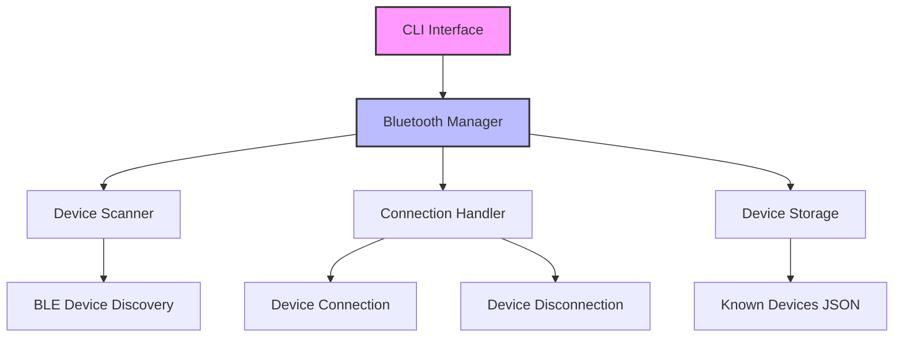
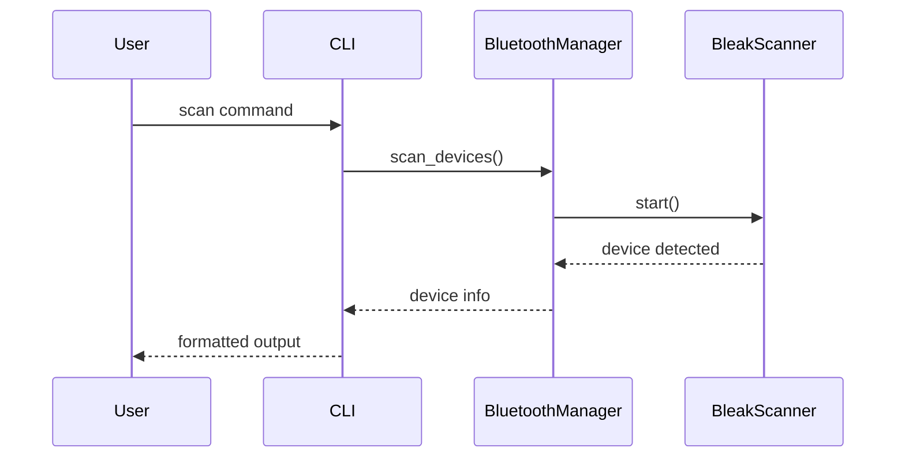

# <h1 align="center">📶Bluetooth Terminal Manager</h1>

<h4 align="center">A powerful Python-based Bluetooth device management CLI tool with advanced scanning and device management capabilities.</h4>

<p align="center">
<a href="https://twitter.com/PinoyITSolution"></a>
<a href="https://github.com/ronknight?tab=followers"></a>
<a href="https://github.com/ronknight/ronknight/stargazers"></a>
<a href="https://github.com/ronknight/ronknight/network/members"></a>
<a href="https://youtube.com/@PinoyITSolution"></a>
<a href="https://github.com/ronknight/bluetooth-terminal-manager/issues"></a>
<a href="https://github.com/ronknight/bluetooth-terminal-manager/blob/master/LICENSE"></a>
<a href="#"></a>
<a href="https://github.com/ronknight"></a>
</p>

<p align="center">
  <a href="#requirements">Requirements</a> •
  <a href="#features">Features</a> •
  <a href="#installation">Installation</a> •
  <a href="#usage">Usage</a> •
  <a href="#diagrams">Diagrams</a>
</p>

---

## 📋 Requirements

- Python 3.7+
- Bluetooth adapter
- Windows/Linux/macOS

## ⚡ Features

- Advanced device scanning with multiple modes (quick, normal, deep)
- Visual signal strength indicators
- Device connection management
- Detailed device information display
- Known devices management
- Colorful terminal output
- Continuous scanning mode

## 🚀 Installation

```bash
# Clone the repository
git clone https://github.com/ronknight/bluetooth-terminal-manager.git

# Install dependencies
pip install -r requirements.txt
```

## 💻 Usage

```bash
# Scan for devices
python cli.py scan

# Scan with options
python cli.py scan --duration 30 --mode deep --continuous

# Get device info
python cli.py info <device-address>

# Connect to device
python cli.py connect <device-address>

# List known devices
python cli.py known-devices

# Forget a device
python cli.py forget <device-address>
```

## 📊 Diagrams

### Project Architecture



### Scan Workflow



## 🤝 Contributing

Contributions are welcome! Please feel free to submit a Pull Request. For major changes, please open an issue first to discuss what you would like to change.

## 📄 License

This project is licensed under the MIT License - see the LICENSE file for details.

---

<p align="center">Made with ❤️ by Ronknight</p>
